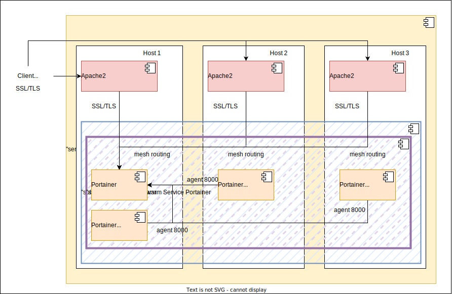

# Ansible playbook: labocbz.deploy_docker_swarm


## Description


An Ansible playbook to deploy and configure a Docker Swarm cluster on your hosts.


This Ansible playbook offers a comprehensive and automated solution for deploying and managing Docker Swarm, with a focus on simplifying the initialization and configuration process. The playbook seamlessly installs Docker, configures it to serve as a Swarm, and intelligently determines and designates nodes as managers and workers. The Swarm initialization process generates two crucial tokens: one for manager nodes and another for worker nodes.

Upon successful Swarm initialization, the playbook orchestrates the deployment of the Portainer service. This service comprises a Portainer instance on a manager node and a replicated set of N agents distributed across all three nodes in the Swarm (adjustable by modifying the service Portainer file). The service configuration file is consistently present on all nodes, allowing post-deployment modifications without complications.

To enhance security, SSL/TLS encryption can be applied to Portainer access, and the same holds true for the Swarm, where additional mTLS can be implemented using certificates.

The playbook further provides the option to secure Portainer from external access by installing an Apache2 server with a baseline of security measures on nodes where the variable inv_install_apache is set to true. Apache2 can be installed on all nodes, leveraging mesh routing to access services seamlessly regardless of the target node.

Users have the flexibility to configure node cleanup cron jobs for the removal of unused elements and can opt to install Watchtower for automated infrastructure updates, although it is advised to exercise caution in enabling this feature.

## Deployment diagramm



Here is a potential deployment scenario using the playbook. We can observe that Portainer is installed on the same host as Apache2, which then functions as an SSL/TLS reverse proxy, WAF, QoS, Auth, etc. Portainer is primarily used for administering other servers, which connect through the default client port 8000 and cannot be included in the reverse proxy but accessible with the Portainer network of the Portainer service.

## Tests and simulations

### Basics

You have to run multiples tests. *tests with an # are mandatory*

```MARKDOWN
# lint
# syntax
# converge
# idempotence
# verify
side_effect
```

Executing theses test in this order is called a "scenario" and Molecule can handle them.

Molecule use Ansible and pre configured playbook to create containers, prepare them, converge (run the playbook) and verify its execution.
You can manage multiples scenario with multiples tests in order to get a 100% code coverage.

This playbook contains a ./tests folder. In this folder you can use the inventory or the tower folder to create a simualtion of a real inventory and a real AWX / Tower job execution.

### Command reminder

```SHELL
# Check your YAML syntax
yamllint -c ./.yamllint .

# Check your Ansible syntax and code security
ansible-lint --config=./.ansible-lint .

# Execute and test your playbook
molecule lint
molecule create
molecule list
molecule converge
molecule verify
molecule destroy

# Execute all previous task in one single command
molecule test
```

## Installation

To install this playbook, just copy/import this playbook or raw file into your fresh playbook repository or call it with the "include_playbook/import_playbook" module.

## Usage

### Vars

```YAML
# From inventory
---
# all vars from to put/from your inventory
# see tests/inventory/group_var for all groups and vars.
```

```YAML
# From AWX / Tower
---

```

## Architectural Decisions Records

Here you can put your change to keep a trace of your work and decisions.

### 2023-12-29: First Init

* First init of this playbook with the bootstrap_playbook playbook by Lord Robin Crombez
* Added playbook
* Added readme
* Tested and validated in develop / validation

### 2024-03-02: Fix and CI

* Added support for new CI base
* Edit all vars with __
* Refaco and tested on Debian 11/12
* Refacto and tested Ubuntu 22

## Authors

* Lord Robin Crombez

## Sources

* [Ansible playbook documentation](https://docs.ansible.com/ansible/latest/playbook_guide/playbooks_reuse_playbooks.html)
* [Ansible Molecule documentation](https://molecule.readthedocs.io/)
* [labocbz.prepare_host]("https://github.com/CBZ-D-velop/Ansible-Role-Labocbz-Prepare-Host.git")
* [labocbz.add_certificates]("https://github.com/CBZ-D-velop/Ansible-Role-Labocbz-Add-Certificates.git")
* [labocbz.install_docker]("https://github.com/CBZ-D-velop/Ansible-Role-Labocbz-Install-Docker.git")
* [labocbz.install_apache]("https://github.com/CBZ-D-velop/Ansible-Role-Labocbz-Install-Apache.git")
* [labocbz.add_apache_confs]("https://github.com/CBZ-D-velop/Ansible-Role-Labocbz-Add-Apache-Confs.git")
* [labocbz.add_logrotate_confs]("https://github.com/CBZ-D-velop/Ansible-Role-Labocbz-Add-Logrotate-Confs.git")
* [labocbz.add_docker_swarm]("https://github.com/CBZ-D-velop/Ansible-Role-Labocbz-Add-Docker-Swarm.git)
